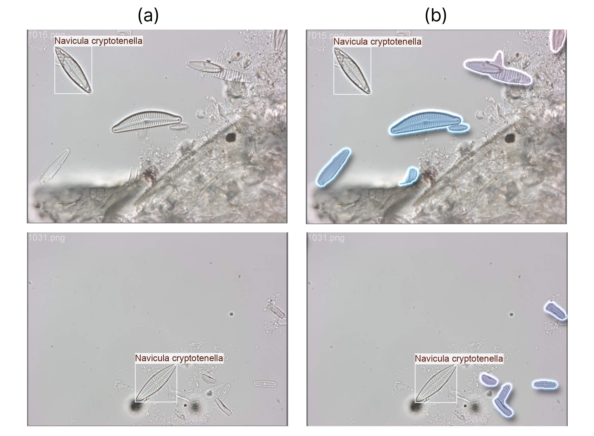
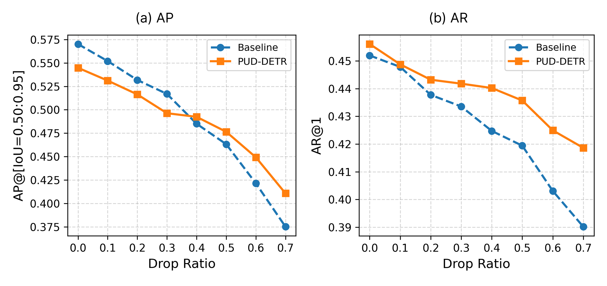
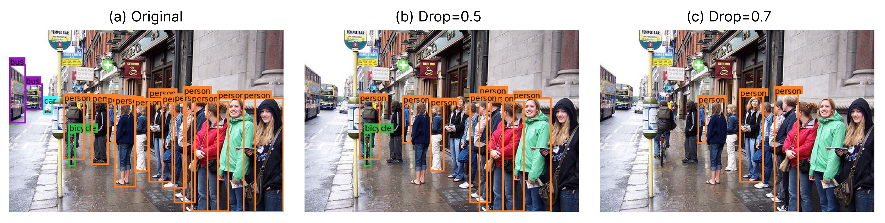

# PUD-DETR

**Positive-Unlabeled Deformable DETR for Object Detection under Incomplete Annotations**

PUD-DETR integrates non-negative positive-unlabeled (nnPU) classification risk into Deformable DETR. With incomplete annotations, a real object may have no bounding-box label and receive incorrect background supervision. PUD-DETR treats query–class entries without observed positive assignments as unlabeled and reconstructs their negative risk, while retaining Hungarian matching and bounding-box regression.



Available annotations (left) and additional visible diatom instances (right), illustrating missing labels.

## Paper results

The paper reports three-seed experiments on PASCAL VOC 2007 and an inherently incompletely annotated diatom dataset. PN has higher VOC AP at configured drop ratios 0.0–0.3; PUD-DETR has higher AP at 0.4–0.7. At configured drop=0.7, AP is **41.07 ± 0.72** for PUD-DETR and **37.51 ± 1.21** for PN. On diatoms, AR1 is **84.33 ± 1.95** versus **82.53 ± 0.87**, using the paper's selected positive-risk scale of 7. These values are on a 0–100 scale.



## Repository structure

```text
.
├── train_pud_detr.py                   # PN baseline and PUD-DETR
├── requirements.txt                    # Preserved experimental dependency pins
├── scripts/
│   ├── gpu_selection.py                # GPU/device configuration
│   ├── convert_voc_to_coco.py          # VOC-to-COCO conversion
│   └── drop_voc_instances.py           # Training-box removal
└── datasets/
    ├── VOC2007/coco_annotations/       # Complete splits + drop=0.1 through 0.7
    └── diatom/                         # Experiment train/val/test COCO annotations
```

## Environment / dependencies

The preserved requirements use CUDA 12.6 PyTorch wheels. Use a Linux environment with a compatible NVIDIA GPU/driver for training. 

```bash
git clone https://github.com/kjh0902/pud_detr.git
cd pud_detr
python3.12 -m venv .venv
source .venv/bin/activate
python -m pip install -r requirements.txt
```

## Dataset preparation

### PASCAL VOC 2007

Obtain the VOC2007 train/validation and test data from the [PASCAL VOC 2007 project](http://host.robots.ox.ac.uk/pascal/VOC/voc2007/), following its access and use conditions. 

### Drop-ratio annotations

Use the committed files directly to preserve the supplied experimental masks. Validation and test use the same complete annotation files for every training drop setting.

| Configured drop | Training JSON | Retained boxes | Actual removed fraction |
| --- | --- | ---: | ---: |
| 0.0 | `pascal_train.json` | 7,844 | 0.000000 |
| 0.1 | `pascal_train_drop_0.1.json` | 7,060 | 0.099949 |
| 0.2 | `pascal_train_drop_0.2.json` | 6,275 | 0.200025 |
| 0.3 | `pascal_train_drop_0.3.json` | 5,491 | 0.299975 |
| 0.4 | `pascal_train_drop_0.4.json` | 4,706 | 0.400051 |
| 0.5 | `pascal_train_drop_0.5.json` | 3,922 | 0.500000 |
| 0.6 | `pascal_train_drop_0.6.json` | 3,138 | 0.599949 |
| 0.7 | `pascal_train_drop_0.7.json` | 2,501 | 0.681158 |

Each incomplete training file retains the same 2,501 images and at least one box per image. Configured drop=0.7 reaches the maximum feasible removal of 5,343 / 7,844 boxes (about 68.12%). 



### Diatom dataset

The manuscript uses the dataset described by Gündüz, Solak, and Günal, *Segmentation of diatoms using edge detection and deep learning* (2022), [DOI: 10.55730/1300-0632.3938](https://doi.org/10.55730/1300-0632.3938). After excluding 13 unannotated images, the paper reports 2,184 microscopy images across 68 species, split into **1,520 train / 327 validation / 337 test** images. No synthetic drop is applied.

The experiment-specific COCO annotations and split membership are included as `datasets/diatom/diatom_train.json`, `diatom_val.json`, and `diatom_test.json`. They contain 2,118 / 456 / 453 boxes respectively (3,027 total), with category IDs 0–67. Obtain the raw microscopy images through the dataset authors' distribution and place them under a shared image root matching the JSON `file_name` entries:

```text
datasets/diatom/
├── images/             # Download separately; preserve JSON-relative filenames
├── diatom_train.json
├── diatom_val.json
└── diatom_test.json
```

The paper selects **`--weight-p 7` using validation AR1** and reports AR1/AR10/AR100.

## Training

Run from the repository root. 

### PN baseline

```bash
python train_pud_detr.py \
  --method pn --experiment-name voc_drop07_pn \
  --seeds 0 1 2 --device 0 --batch-size 2 --epochs 20 \
  --drop-ratio 0.7 \
  --train-json datasets/VOC2007/coco_annotations/pascal_train_drop_0.7.json \
  --val-json datasets/VOC2007/coco_annotations/pascal_val.json \
  --test-json datasets/VOC2007/coco_annotations/pascal_test.json \
  --trainval-image-dir datasets/VOC2007/JPEGImages \
  --test-image-dir datasets/VOC2007/JPEGImages
```

### PUD-DETR

```bash
python train_pud_detr.py \
  --method pud --weight-p 8 --reduction global \
  --experiment-name voc_drop07_pud \
  --seeds 0 1 2 --device 0 --batch-size 2 --epochs 20 \
  --drop-ratio 0.7 \
  --train-json datasets/VOC2007/coco_annotations/pascal_train_drop_0.7.json \
  --val-json datasets/VOC2007/coco_annotations/pascal_val.json \
  --test-json datasets/VOC2007/coco_annotations/pascal_test.json \
  --trainval-image-dir datasets/VOC2007/JPEGImages \
  --test-image-dir datasets/VOC2007/JPEGImages
```

Diatom training with the paper-selected scale:

```bash
python train_pud_detr.py \
  --method pud --weight-p 7 --reduction global \
  --experiment-name diatom_pud \
  --seeds 0 1 2 --device 0 --batch-size 2 --epochs 20 \
  --train-json datasets/diatom/diatom_train.json \
  --val-json datasets/diatom/diatom_val.json \
  --test-json datasets/diatom/diatom_test.json \
  --trainval-image-dir datasets/diatom/images \
  --test-image-dir datasets/diatom/images
```

## Citation

Paper title: *PUD-DETR: Positive-Unlabeled Deformable DETR for Object Detection under Incomplete Annotations*.

Authors: Junhyung Kim, Jiseok Son, Jungjae Park, Jiwoo Han, and Tae Hyung Kim.

Publication details, a paper link, and the final BibTeX entry will be added here when available.

<!-- Add the verified venue, year, DOI/arXiv identifier, and final BibTeX here. -->
